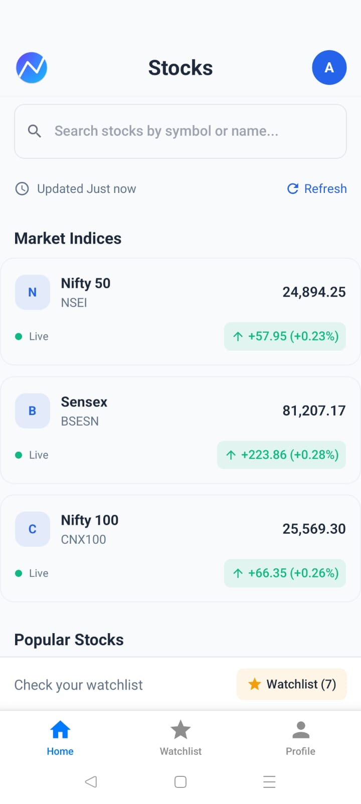
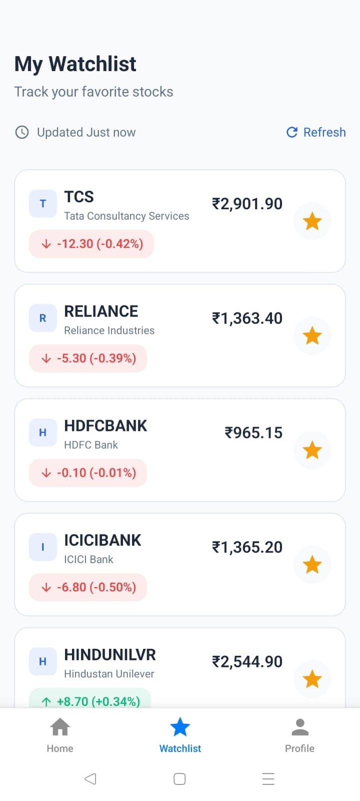
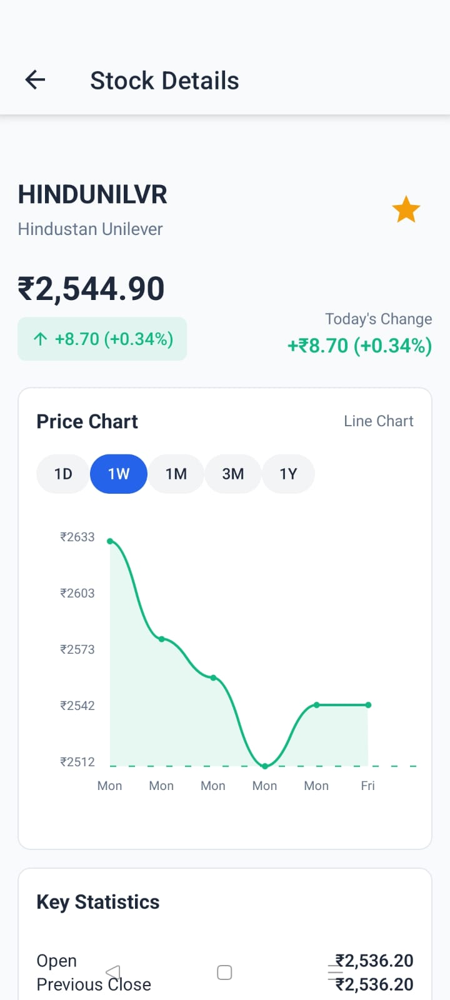

# 📈 Indian Stock Market Tracker App

A **React Native + Expo** mobile application to track Indian stock market indices and stocks with **JWT-based authentication** and a **Node.js + Express backend**. Users can search for stocks, view details, and manage their personalized watchlist with real-time updates.

---

## 🚀 Features

### 📊 Frontend (React Native + Expo)
- **Home / Dashboard Screen**
  - Top Market Indices: NSE, BSE, Nifty 50, Sensex.
  - Stock list with:
    - Symbol, Company Name, Current Price, % Change.
    - Add/Remove stock to Watchlist.
  - Auto-refresh every **10 seconds**.
  - Search stocks by symbol/company.
  - Tap stock → Navigate to **Stock Detail Screen**.

- **Watchlist Screen**
  - Personalized user’s saved stocks.
  - Same details as Home screen.
  - Add/Remove directly from watchlist.
  - Auto-refresh every **10 seconds**.

- **Stock Detail Screen**
  - Interactive chart using **react-native-chart-kit** (`LineChart`).
  - Chart intervals available:
    - `1D` → value: `1d`
    - `1W` → value: `1wk`
    - `1M` → value: `1mo`
    - `3M` → value: `3mo`
    - `1Y` → value: `1y`
  - Display current price, high/low, volume, % change.
  - Option to add/remove stock to Watchlist.
  - Auto-updates with backend data.


- **Navigation**
  - Bottom Tabs: `Home`, `Watchlist`, `Profile`.
  - Stack Navigation:
    - Home → Stock Detail
    - Watchlist → Stock Detail

- **UI/Styling**
  - Built with **NativeWind (TailwindCSS)** & **React Native Paper**.
  - Color-coded prices (green for gain, red for loss).
  - Loading states & error handling.
  - Responsive charts & stock lists.
  - Visual feedback when adding/removing watchlist items.

---
## 📷 App Screenshots / Images

You can add your app screenshots or promotional images here:

  
  
  

> Replace the image paths above with your actual screenshots.

---

### ⚙️ Backend (Node.js + Express)
- **Authentication (JWT)**
  - `/auth/register` → Register user.
  - `/auth/login` → Login and get JWT.
  - JWT stored securely in **Expo SecureStore**.
  - Protected routes require valid JWT.

- **Stock APIs**
  - `/stocks` → Get latest stock prices.
  - `/indices` → Get index data.
  - `/watchlist` → Add/remove/get user’s watchlist (JWT protected).

- **Implementation**
  - Uses [`yahoo-finance2`](https://www.npmjs.com/package/yahoo-finance2) for stock/indices data.
  - Backend polls stock data every **10 seconds**.
  - Secure API keys with **environment variables**.
  - Caching & rate-limiting for performance.

---

## 🛠️ Tech Stack

| Layer       | Technology                           |
|-------------|---------------------------------------|
| Frontend    | React Native + Expo                  |
| UI          | NativeWind (Tailwind), React Native Paper |
| Charts      | react-native-chart-kit               |
| Backend     | Node.js + Express                    |
| Database    | MongoDB                              |
| Auth        | JWT                                  |
| Data Source | yahoo-finance2 npm package           |
| Storage     | SecureStore (Expo)                   |

---

## 🔑 Authentication
- Users must **login/register** to manage their Watchlist.
- JWT is issued by backend and stored securely in **Expo SecureStore**.
- Protected API routes require valid JWT in headers.

---

## 📡 Real-Time Updates
- Stock list & Watchlist auto-refresh every **10 seconds**.
- Smooth UI updates with loading states.
- Graceful error handling for failed API calls.

---


## 📦 Installation

### Prerequisites
- Node.js & npm
- Expo CLI
- MongoDB instance (local or cloud)

### Clone Repository
```bash
git clone https://github.com/your-username/stock-tracker-app.git
cd stock-tracker-app

Backend Setup
cd stock-tracker-backend
npm install
# create a .env file with:
# MONGO_URI=your_mongo_connection
# JWT_SECRET=your_secret_key
# PORT=5000
# NODE_ENV=development
npm start


Frontend Setup
cd stock-tracker-frontend
npm install
# create .env file:
# EXPO_PUBLIC_API_URL=http://localhost:5000
npx expo start

